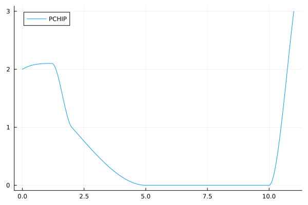

# PCHIPInterpolation.jl

[](https://github.com/gerlero/PCHIPInterpolation.jl/actions/workflows/CI.yml?query=branch%3Amain)
[](https://codecov.io/gh/gerlero/PCHIPInterpolation.jl)

PCHIP (Piecewise Cubic Hermite Interpolating Polynomial) spline interpolation of arbitrarily spaced one-dimensional data in Julia. This package is a fork of [SimplePCHIP](https://github.com/slabanja/SimplePCHIP) with some extra features.

PCHIP interpolation preserves monotonicity (i.e., it will not over- or undershoot monotonic data points). Continue reading for an example.


## Summary

### Create a PCHIP interpolator

```jl
using PCHIPInterpolation

xs = [0.0,  1.2,  2.0,  5.0, 10.0, 11.0]
ys = [2.0,  2.1,  1.0,  0.0,  0.0,  3.0]

itp = Interpolator(xs, ys)
```

### Evaluate

```jl
y = itp(1.5) # At a single point
ys = itp.(xs) # At multiple points
```

### Plot

```jl
using Plots

plot(itp, label="PCHIP")
```



### Compute a definite integral

```jl
integral = integrate(itp, 1, 3) # Integral between 1 and 3. 
```
